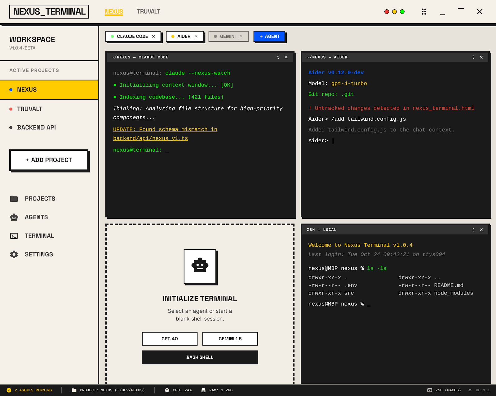
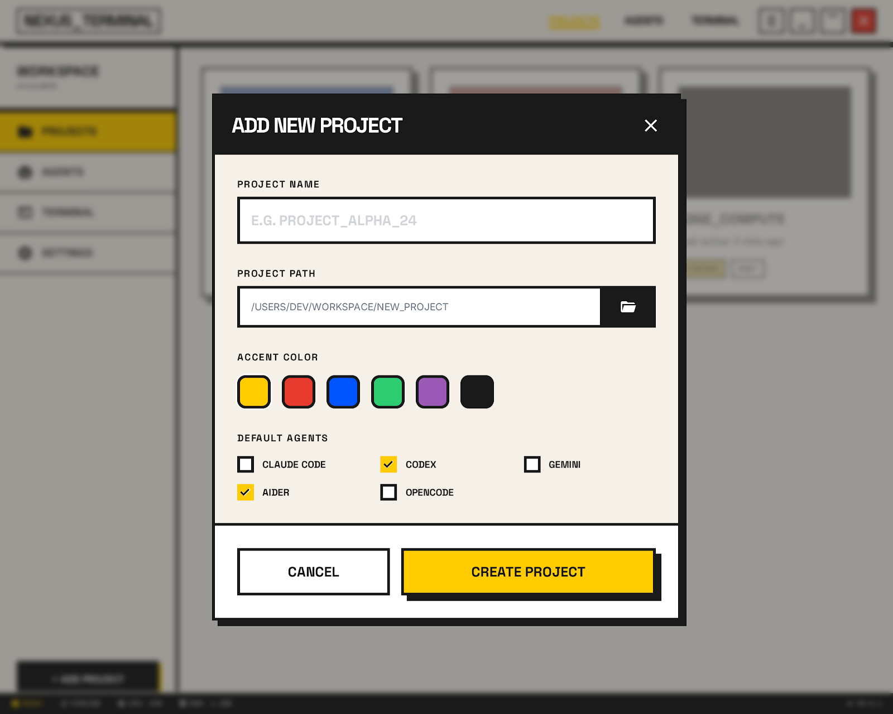
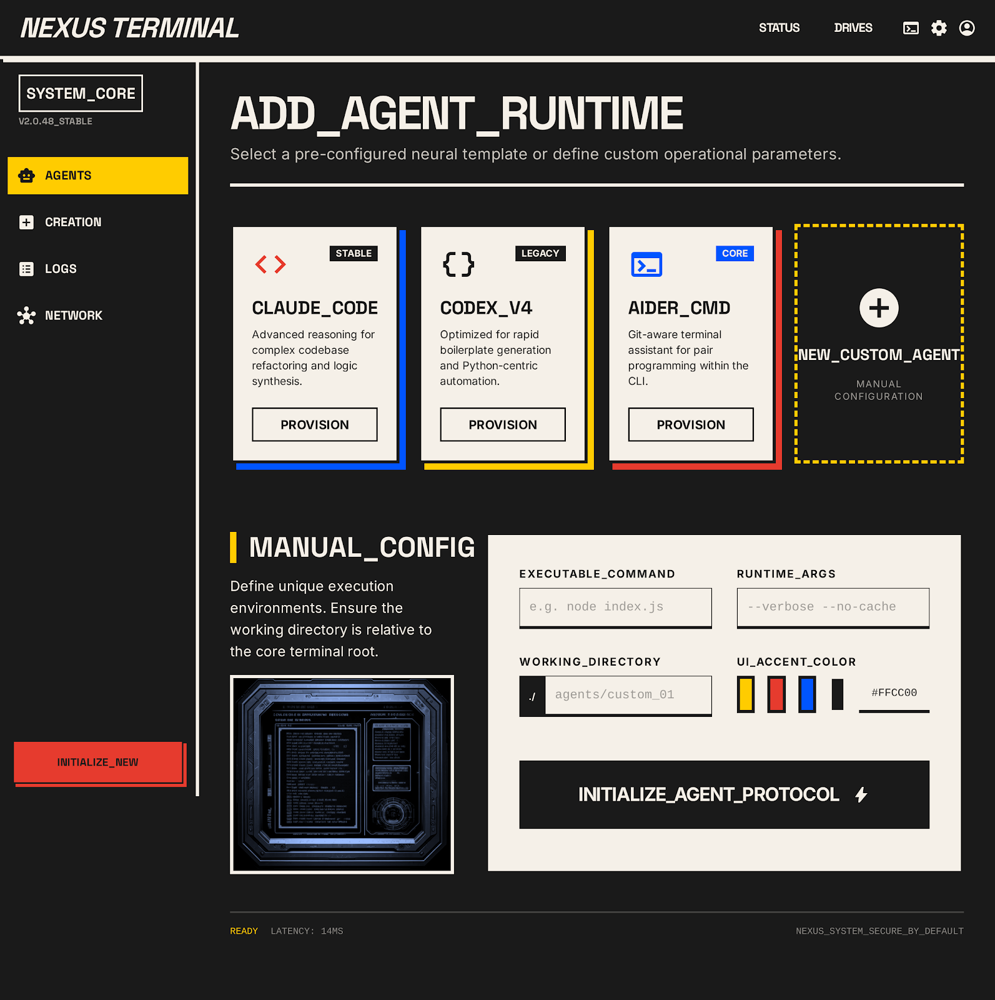
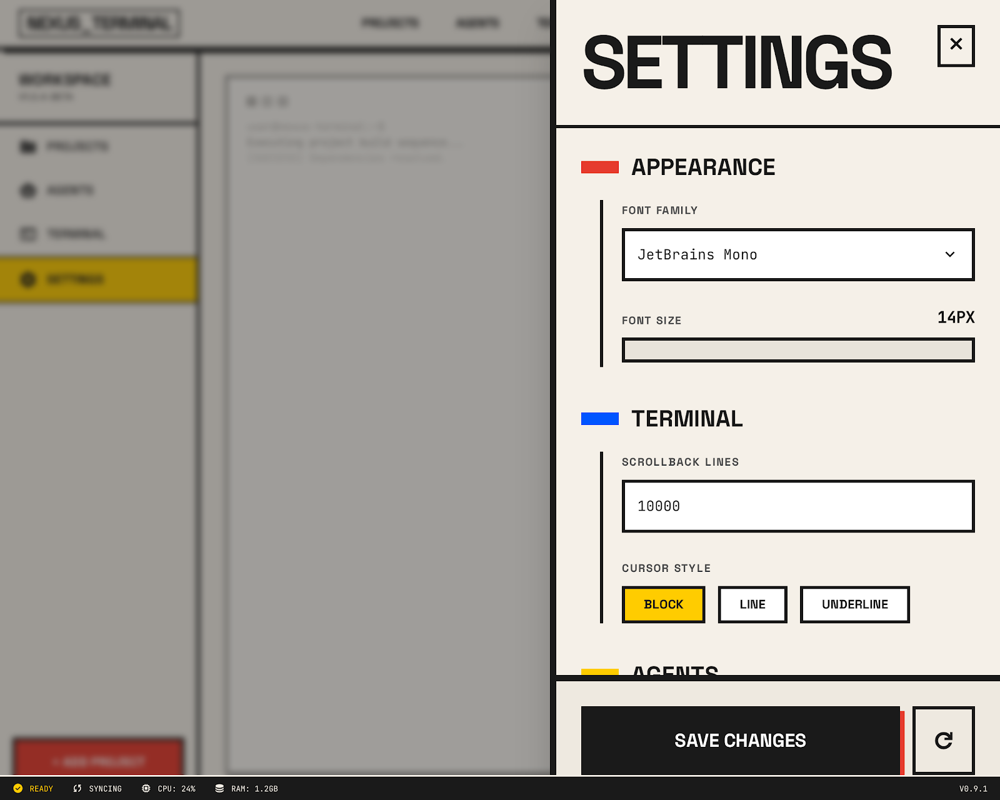
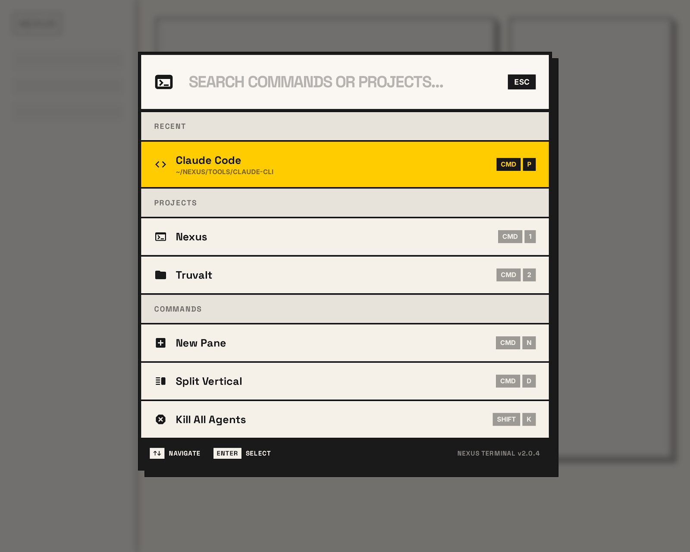
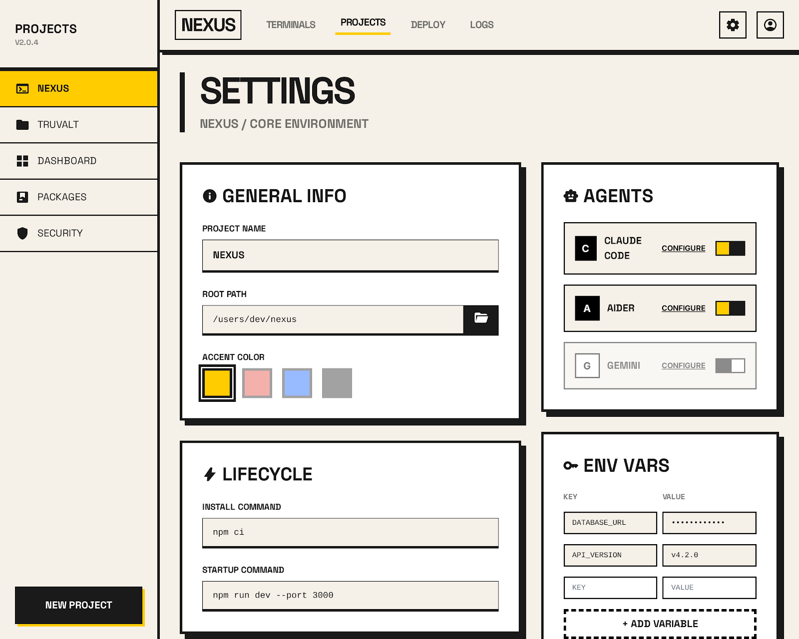

# Nexus Terminal

> **Multi-agent AI terminal workspace** — run Claude Code, Codex CLI, Gemini CLI, Qwen, Aider, and more, side-by-side in a brutalist desktop app.



---

## Features

- **13+ AI coding agents** — Claude Code, Codex CLI, Gemini CLI, Aider, OpenCode, Qwen Code, Junie, Kiro, Kilo Code, Cline, Continue, Goose, Amp — auto-detected on PATH
- **Terminal tabs per project** — each project has independent terminal tabs; the `+` button opens a new tab
- **Split panes** — split horizontally or vertically (up to 2×2); the split button toggles 1→2→1
- **Kanban board** — every project gets a built-in `◈ KANBAN` tab with Todo / In Progress / Done / Blocked columns; tasks persist across restarts
- **Session persistence** — terminals survive app restarts; layout and sessions are restored automatically
- **True-color PTY** — `xterm-256color` + `COLORTERM=truecolor` injected; TUI tools (Codex, lazygit, etc.) render correctly  
- **Credential inheritance** — PTY spawner inherits your full shell environment (API keys, PATH, etc.) so agents are already logged in
- **Brutalist UI** — high-contrast dark mode, Space Grotesk typography, yellow accent (`#ffcc00`), pixel-shadow components

---

## Screenshots

| Main Workspace | Add Project |
|:-:|:-:|
|  |  |

| Add Agent | Settings |
|:-:|:-:|
|  |  |

| Command Palette | Project Settings |
|:-:|:-:|
|  |  |

---

## Install

### ⚡ One-line install (no manual setup required)

Paste this in your terminal. It automatically installs system libraries, Rust, Node.js, and Nexus itself:

```bash
curl -fsSL https://raw.githubusercontent.com/abhay-byte/nexus/main/install.sh | bash
```

Then launch from anywhere:
```bash
nexus
```

> **Requires `~/.local/bin` in your PATH** — the script will tell you if you need to add it.  
> Add `export PATH="$HOME/.local/bin:$PATH"` to `~/.bashrc` / `~/.zshrc` if needed, then `source ~/.bashrc`.

**What the script does:**
1. Detects your distro (Debian/Ubuntu, Arch, Fedora, openSUSE) and installs Tauri system libraries
2. Installs **Rust** via `rustup` if not present
3. Installs **Node.js 20** via `fnm` if not present
4. Clones this repo to a temp directory
5. Builds the release binary (`npm run tauri build --no-bundle`)
6. Copies the binary to `~/.local/bin/nexus`
7. Creates a `.desktop` entry so it appears in your app launcher

---

### Manual install (from cloned repo)

If you already have Node.js ≥ 18 and Rust + Cargo installed:

```bash
# Install Tauri system dependencies (Debian/Ubuntu)
sudo apt install -y libwebkit2gtk-4.1-dev libgtk-3-dev libayatana-appindicator3-dev librsvg2-dev libssl-dev

# Clone + build + install
git clone https://github.com/abhay-byte/nexus.git && cd nexus && ./install.sh
```

---

## Tech Stack

| Layer | Tech |
|---|---|
| Desktop shell | [Tauri v2](https://tauri.app) (Rust) |
| Frontend | React 18 + TypeScript + Vite |
| State | Zustand |
| Terminal | xterm.js via `@xterm/xterm` |
| PTY backend | `portable-pty` (Rust) |
| Styling | Tailwind CSS (utility-only) + custom brutalist tokens |

---

## Dev Setup

```bash
git clone https://github.com/abhay-byte/nexus.git
cd nexus
npm install
./run.sh          # sources your shell profile then starts dev server
# OR
npm run tauri dev
```

---

## Keyboard Shortcuts

| Shortcut | Action |
|---|---|
| `Ctrl+Shift+T` | Vertical split (new pane) |
| `Ctrl+Shift+W` | Kill focused session |
| `Ctrl+Tab` | Next project |
| `Ctrl+Shift+Tab` | Previous project |
| `Ctrl+Q` | Quit |

---

## Supported Agents

| Agent | Command | Notes |
|---|---|---|
| Claude Code | `claude` | `--dangerously-skip-permissions` flag auto-added |
| Codex CLI | `codex` | |
| Gemini CLI | `gemini` | |
| Aider | `aider` | |
| OpenCode | `opencode` | |
| Qwen Code | `qwen` | |
| Junie | `junie` | JetBrains |
| Kiro | `kiro` | |
| Kilo Code | `kilo-code` | |
| Cline | `cline` | |
| Continue | `continue` | |
| Goose | `goose` | Block |
| Amp | `amp` | |

Only installed agents (detected via `which`) are shown as enabled in the launcher.

---

## Project Structure

```
nexus/
├── src/                    # React frontend
│   ├── components/         # UI components
│   │   ├── AgentBar/       # Running session tabs + launch dropdown
│   │   ├── Kanban/         # Per-project Kanban board
│   │   ├── PaneGrid/       # Split terminal grid
│   │   ├── TerminalTabBar/ # Terminal tab navigation
│   │   └── Titlebar/       # Window chrome
│   ├── store/
│   │   ├── kanbanStore.ts  # Kanban tasks (persisted to localStorage)
│   │   ├── projectStore.ts # Projects (persisted to disk)
│   │   └── sessionStore.ts # Sessions, layouts, tabs (persisted to disk)
│   └── types/              # Shared TypeScript types
├── src-tauri/              # Rust backend
│   ├── src/
│   │   ├── lib.rs          # Tauri commands
│   │   └── pty.rs          # PTY spawn / resize / kill
│   └── capabilities/       # Tauri permission config
├── docs/screenshots/       # README screenshots
├── install.sh              # System-wide install (one command, zero deps)
└── run.sh                  # Dev launcher (sources shell profile)
```

---

## License

MIT © 2025 Abhay
