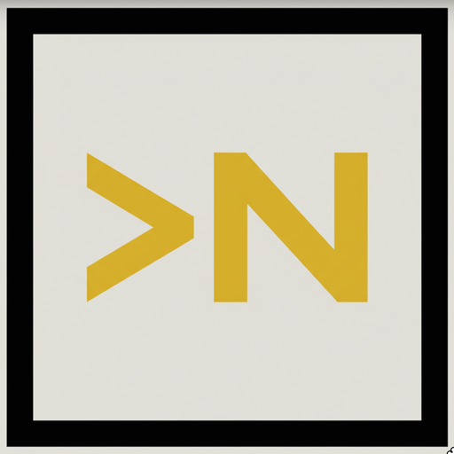
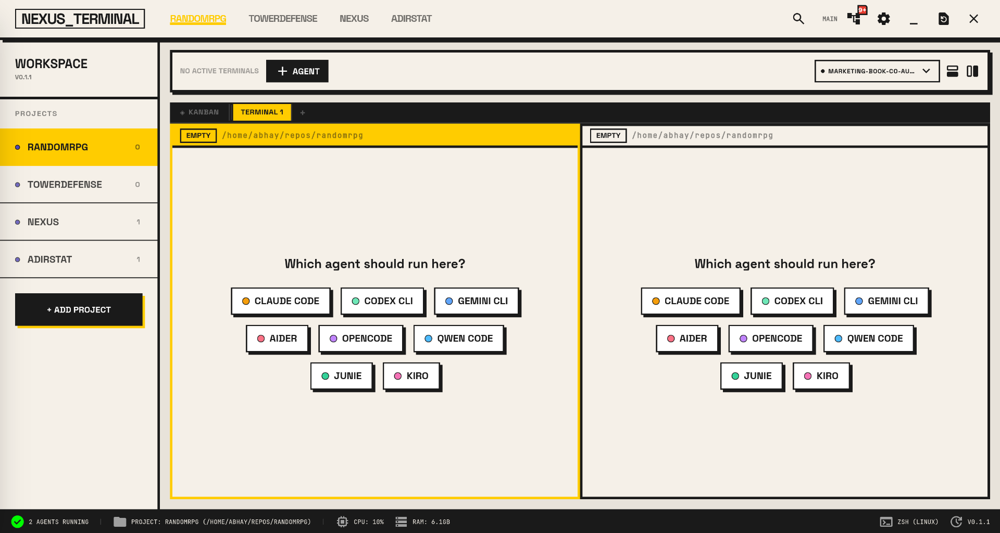
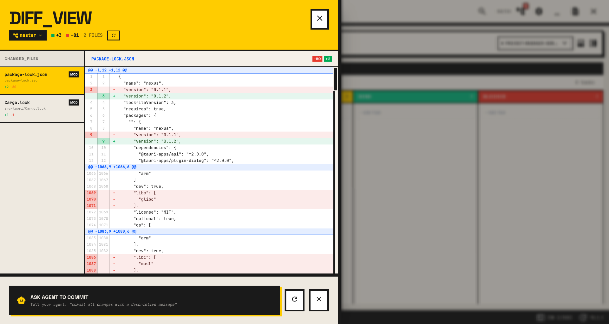
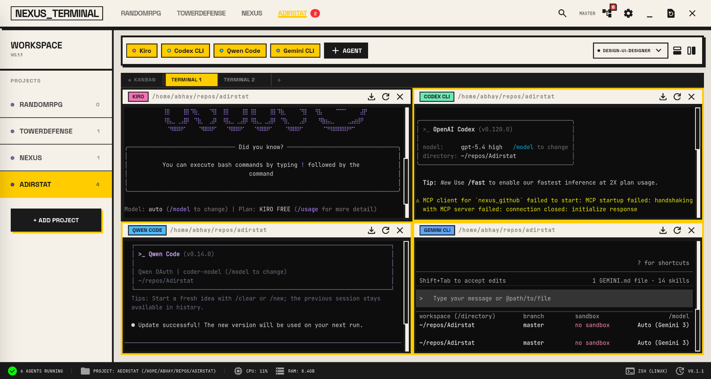
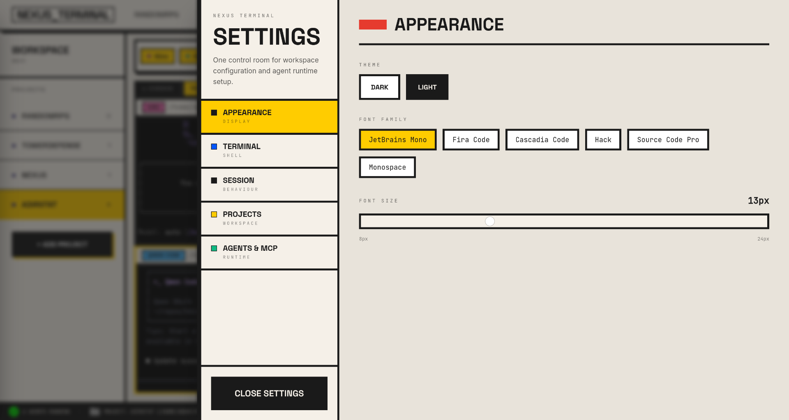

# Nexus Terminal

<p align="center">
  
</p>

<p align="center">
  <strong>Multi-agent AI terminal workspace</strong><br>
  Run Claude Code, Codex CLI, Gemini CLI, Qwen, Aider, and more — side-by-side in a brutalist desktop app.
</p>

<p align="center">
  <a href="https://github.com/abhay-byte/nexus/releases/latest"></a>
  
  
</p>

---

## Screenshots

| 1. Main Workspace | 2. Add Project |
|:-:|:-:|
|  |  |

| 3. Project View | 4. Agent Sessions |
|:-:|:-:|
|  |  |

| 5. Split Panes | 6. Kanban Board |
|:-:|:-:|
|  |  |

| 7. Settings | 8. Command Palette |
|:-:|:-:|
|  |  |

---

## Features

### Multi-Agent Support
- **13+ AI coding agents** — Claude Code, Codex CLI, Gemini CLI, Aider, OpenCode, Qwen Code, Junie, Kiro, Kilo Code, Cline, Continue, Goose, Amp
- Auto-detected on PATH — only installed agents appear in the launcher
- Run multiple agents side-by-side in the same project

### Terminal Management
- **Terminal tabs per project** — each project has independent terminal tabs
- **Split panes** — split horizontally or vertically (up to 2×2)
- **Session persistence** — terminals survive app restarts; layout and sessions restored automatically
- **True-color PTY** — `xterm-256color` + `COLORTERM=truecolor` for proper TUI rendering
- **Batched terminal streaming** — noisy agents are buffered to prevent UI thrashing

### Project Organization
- **Kanban board** — built-in `◈ KANBAN` tab with Todo / In Progress / Done / Blocked columns
- Tasks persist across restarts
- Per-project settings and agent configurations

### Configuration & Workflow
- **Credential inheritance** — PTY spawner inherits full shell environment (API keys, PATH, etc.)
- **Shared MCP registry** — configure MCP once in Settings, sync across all projects
- **Workflow add-ons** — bootstrap Spec Kit, install `AGENCY.md` specialist, Caveman integration

### User Interface
- **Brutalist UI** — high-contrast dark mode, Space Grotesk typography
- **Yellow accent** (`#ffcc00`) with pixel-shadow components
- **Command palette** — quick access to all actions
- Native window decorations optional

---

## Install

> **[⬇ Download latest release](https://github.com/abhay-byte/nexus/releases/latest)**

### Linux

**x64:**
```bash
tar -xzf Nexus_linux_x64.tar.gz
cp Nexus_linux_x64/nexus ~/.local/bin/nexus
chmod +x ~/.local/bin/nexus
nexus
```

**ARM64:**
```bash
tar -xzf Nexus_linux_arm64.tar.gz
cp Nexus_linux_arm64/nexus ~/.local/bin/nexus
chmod +x ~/.local/bin/nexus
nexus
```

Or use the installer script:
```bash
./install.sh  # Auto-detects architecture
```

### Windows

Download `Nexus_windows_x64.zip` or `Nexus_windows_arm64.zip`, extract, and run `nexus.exe`.

Or use PowerShell:
```powershell
./install.ps1  # Auto-detects architecture
```

---

## Dev Setup

```bash
git clone https://github.com/abhay-byte/nexus.git
cd nexus
npm install
npm run tauri dev
```

For ARM64 cross-compilation, see [docs/building-arm64.md](docs/building-arm64.md).

---

## Keyboard Shortcuts

| Shortcut | Action |
|---|---|
| `Ctrl+Shift+T` | Vertical split (new pane) |
| `Ctrl+Shift+W` | Kill focused session |
| `Ctrl+Tab` | Next project |
| `Ctrl+Shift+Tab` | Previous project |
| `Ctrl+Q` | Quit |

---

## Supported Agents

| Agent | Command | Notes |
|---|---|---|
| Claude Code | `claude` | `--dangerously-skip-permissions` flag auto-added |
| Codex CLI | `codex` | |
| Gemini CLI | `gemini` | |
| Aider | `aider` | |
| OpenCode | `opencode` | |
| Qwen Code | `qwen` | |
| Junie | `junie` | JetBrains |
| Kiro | `kiro` | |
| Kilo Code | `kilo-code` | |
| Cline | `cline` | |
| Continue | `continue` | |
| Goose | `goose` | Block |
| Amp | `amp` | |

---

## Tech Stack

| Layer | Tech |
|---|---|
| Desktop shell | [Tauri v2](https://tauri.app) (Rust) |
| Frontend | React 18 + TypeScript + Vite |
| State | Zustand |
| Terminal | xterm.js via `@xterm/xterm` |
| PTY backend | `portable-pty` (Rust) |
| Styling | Tailwind CSS + custom brutalist tokens |

---

## Project Structure

```
nexus/
├── src/                    # React frontend
│   ├── components/         # UI components
│   │   ├── AgentBar/       # Running session tabs + launch dropdown
│   │   ├── Kanban/         # Per-project Kanban board
│   │   ├── PaneGrid/       # Split terminal grid
│   │   ├── TerminalTabBar/ # Terminal tab navigation
│   │   └── Titlebar/       # Window chrome
│   ├── store/              # Zustand stores
│   └── types/              # TypeScript types
├── src-tauri/              # Rust backend
│   ├── src/
│   │   ├── lib.rs          # Tauri commands
│   │   └── pty.rs          # PTY spawn / resize / kill
│   └── capabilities/       # Tauri permissions
├── docs/                   # Documentation
└── install.sh              # System-wide installer
```

---

## License

MIT © 2025 Abhay
