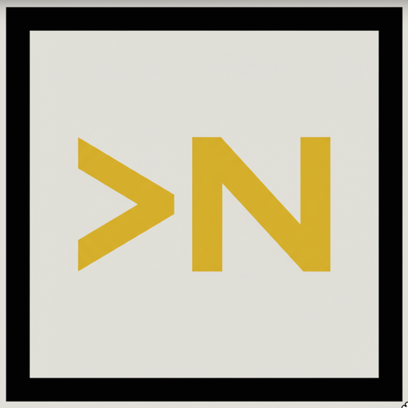
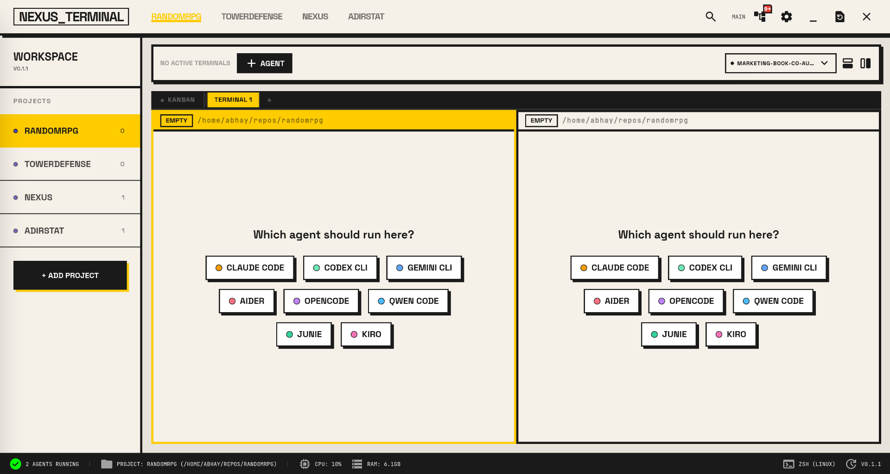
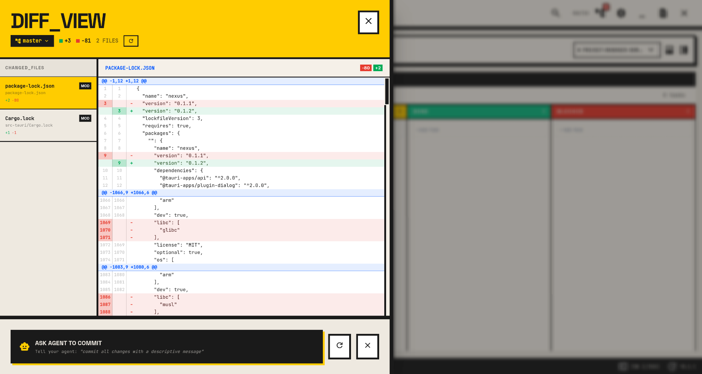
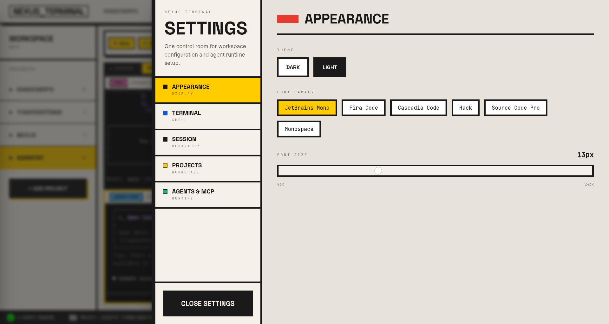

# Nexus Terminal

<p align="center">
  
</p>

<p align="center">
  <strong>Multi-Agent AI Terminal Workspace</strong><br>
  Run Claude Code, Codex CLI, Gemini CLI, Qwen, Aider, and more — side-by-side in split panes.<br>
  <em>Think "tmux meets a project manager meets an AI agent launcher."</em>
</p>

<p align="center">
  <a href="https://github.com/abhay-byte/nexus/releases/latest"></a>
  
  
</p>

> **Dual Mode** — Use as a **desktop app** (Tauri) or run the **standalone web server** and access from any browser on your local network. Same features, same UI.

---

## Screenshots

| 1. Main Workspace | 2. Diff View | 3. Settings |
|:-:|:-:|:-:|
|  |  |  |

---

## Features

### 🤖 Multi-Agent Runner Terminal

- **10 AI coding agents** — Claude Code, Codex CLI, Gemini CLI, Aider, OpenCode, Qwen Code, Junie, Kiro, Kilo Code, Cline
- Auto-detected on PATH — only installed agents appear in launcher
- Run multiple agents side-by-side in **split panes** (up to 2×2 grid) within the same project
- **Custom agents** — add your own agent commands with custom args, env, accent color
- **Terminal tabs per project** — each project has independent tabs with split pane grids
- **Session persistence** — terminals survive restarts; layout and sessions fully restored
- **True-color PTY** — `xterm-256color` + `COLORTERM=truecolor` for proper TUI rendering
- **Direct writer pipeline** — batched PTY → xterm.js rendering to prevent UI freeze under high output
- **Copy on select, paste on right-click**, configurable cursor styles
- **Per-pane zoom** (Ctrl+scroll), 10,000 line scrollback

### 🗂️ Multi-Project Management System

- **Add/remove/reorder projects** with name, path, accent color, custom icon, and category
- **7 project categories**: Web, App, Game, API/Backend, ML/AI, CLI Tool, Other
- **Resizable collapsible sidebar** (drag to reorder projects, right-click context menu)
- **Project tabs** — open multiple projects simultaneously, switching preserves all layouts
- **Agent count badge** per project in sidebar — projects auto-bump to top when agents are running
- **SSH remote project support** — `user@host:/path` format, agents auto-launch over SSH
- **Auto-spawn default agents** per project on open
- **Browser mode** — projects synced via HTTP API for headless server

### 📋 Local Kanban Board

- **Built-in `◈ KANBAN` tab** per project — always present as first tab
- **Four columns**: Todo, In Progress, Done, Blocked
- **Full CRUD**: create, edit (double-click), drag-and-drop between columns, delete
- **Quick status advancement** — one-click move to next status
- **Tasks persist across restarts** via local JSON storage or HTTP API

### ☁️ Planka Self-Hosted Cloud Kanban

- **Full Planka API integration** — connect Nexus to your self-hosted Planka instance
- **3-step connection wizard**: Credentials → Select/Create Project → Select/Create Board
- **Full CRUD sync**: Create/delete projects, create/delete boards, create/update/delete/move cards, create/delete lists
- **Drag-and-drop cards** between lists — auto-syncs to Planka API in real-time
- **Planka proxy** — HTTP proxy through backend to avoid CORS issues
- **WebSocket live sync** — `kanban-refresh` events keep all connected clients in sync
- **Agent instructions panel** — customize how AI agents interact with the kanban board
- **Auto-detection** — if project has Planka config, shows Planka board instead of local
- **Connect/Disconnect/Change Board** controls in UI

### 🧠 AI Agency — Agent Personality Selector

- **Agency agent dropdown** in toolbar — browse and select AI agency personalities
- **65+ specialist agents** from the `agency-agents` catalog across 7 divisions:
  - Design & UX, Engineering, Marketing, Product & Project Management, Support & Operations, Testing & Quality, Specialized
- **Search agents** by name or slug
- **Enable/disable toggle** per agent with green dot indicator
- **Project sync** — writes `AGENCY.md` file to project root with selected agent personality and instructions
- **Change AI personality for any agent** — instructions flow into all agents working on that project
- **Auto-re-sync** on startup if agency files are missing or stale

### 🛠️ CLI AI Tools Harness — Skills & MCP Servers

- **Shared MCP registry** — configure MCP servers once in Settings, sync across all projects
- **7 MCP presets**: context-mode, context7, playwright, github, filesystem, sequential-thinking, android-mcp
- **Per-agent MCP file auto-generation** — Nexus writes proper MCP configs for each agent:
  - Claude Code (`.mcp.json`), Gemini CLI (`.gemini/settings.json`), OpenCode (`.nexus/opencode/opencode.json`)
  - Qwen Code (`.qwen/settings.json`), Kilo Code (`.kilocode/mcp.json`), Junie (`.junie/mcp/mcp.json`)
  - Kiro (`.kiro/settings/mcp.json`), Cline (`.nexus/cline/data/settings/cline_mcp_settings.json`)
- **Codex MCP via launch args** — auto-converts MCP config to CLI arguments
- **Project-scoped values** — `<PROJECT_PATH>` placeholder replacement in MCP server configs
- **Managed manifest** — `.nexus/mcp-managed.json` tracks Nexus-managed entries for clean removal
- **Per-agent MCP install labels**: Project File, Launch Config, Launch Args, or Manual

### 📐 Spec-Kit Integration

- **One-click Spec Kit bootstrap** per project — installs `specify-cli` and initializes `.specify` directory
- **Per-project enable/disable** with agent selection
- **Supported agents**: Codex, Claude Code, Gemini CLI
- **Auto-detection** — checks for `.specify` directory on project load
- **Rust-side bootstrap** — runs `uv tool install specify-cli` then `specify init` automatically

### 🔍 Complete Git Diff Panel

- **Full git diff view** — side-by-side file list + diff hunks with line numbers
- **Color-coded additions/removals** — green/red highlighting in diff hunks table
- **Per-file diff** — click any changed file to load detailed diff
- **Branch switching** — dropdown to list all local/remote branches and checkout
- **Git status badge** — shows changed file count on toolbar button, polls every 5s
- **Commit instruction generator** — "Ask Agent to Commit" button copies commit message + instructions to clipboard
- **Total additions/deletions summary** at top of diff panel
- **Resizable panel** (360-900px), refresh button, working tree clean indicator
- **Keyboard shortcut**: `Ctrl+Shift+G`

### 📁 Project Tree — Hierarchical View & File Preview

- **Collapsible left panel** showing full project file tree (160-480px resizable)
- **Lazy-loading directories** — expand to load children on demand
- **File search** — filter tree by filename
- **15+ file type icons** with colored indicators
- **Image preview** — PNG, JPG, BMP, WebP, SVG, ICO, TIFF loaded in modal viewer
- **Animated GIF preview** — full support for animated GIFs in image viewer
- **Text file preview** — modal with monospace rendering of code/text file contents
- **Comprehensive MIME detection** — code, images, GIFs, video, audio, archives, PDF, executables, fonts
- **Open in system editor** — double-click any file to open in default editor
- **Context menu**: Preview Text, Preview Image, Open in Editor
- **Drag-and-drop files to agents** — drag any file from project tree onto terminal to paste its path
- **Keyboard shortcut**: `Ctrl+Shift+E`

### 📊 Performance Monitor — System Health

- **System health header**: Total CPU %, Total RAM (used/total GB) with progress bar
- **Process list** — PID, Name, CPU%, RAM (MB/GB), Kill button
- **Sortable columns** — click CPU or RAM header to sort ascending/descending
- **Kill any process** — sends SIGKILL directly from the UI
- **Auto-refresh every 2 seconds** via `sysinfo` crate in Rust backend
- **Resizable panel** (280-600px)
- **Live in StatusBar** — CPU/RAM always visible at bottom of workspace

### 🎨 Brutalist UI

- **High-contrast dark mode** with `#1a1a1a` backgrounds, bold borders, pixel shadows
- **Yellow accent** (`#ffcc00`) throughout — buttons, focus rings, active states, badges
- **Space Grotesk typography** with JetBrains Mono for terminals
- **Material Symbols icon font** — consistent iconography across all components
- **Light mode** support toggleable in Settings
- **Custom titlebar** — `decorations: false` with macOS traffic lights, Windows/Linux min/max/close
- **Mobile-responsive** — overlays and responsive sidebar for small screens

### ⚙️ Settings & Configuration

- **Appearance**: Theme (dark/light), font family picker, font size slider (11-16px)
- **Terminal**: Scrollback lines, cursor style (block/bar/underline), cursor blink toggle
- **Session**: Session restore toggle, shell override, agent default args
- **Projects**: Manage projects list, add/remove/edit, Spec-Kit/Caveman one-click install
- **Agents & MCP**: Custom agents, MCP preset installation, per-agent MCP enable/disable
- **Keybindings**: 15 configurable shortcuts — edit, clear, or reset any binding
- **Debug system**: Toggleable namespaced debug logging with runtime `window.__NEXUS_DEBUG__`
- **Log search**: `Ctrl+Shift+F` to search across all terminal session logs, grouped by session

### ⌨️ Keyboard Shortcuts

| Shortcut | Action |
|---|---|
| `Ctrl+Shift+T` | New terminal tab |
| `Ctrl+Shift+W` | Close terminal tab |
| `Ctrl+Shift+D` | Split vertical |
| `Ctrl+Shift+H` | Split horizontal |
| `Ctrl+Shift+X` | Kill focused session |
| `Ctrl+Shift+G` | Toggle Git Diff panel |
| `Ctrl+Shift+E` | Toggle Project Directory panel |
| `Ctrl+Shift+F` | Log search |
| `Ctrl+B` | Toggle sidebar |
| `Ctrl+,` | Toggle Settings |
| `Ctrl+Tab` | Next project |
| `Ctrl+Shift+Tab` | Previous project |
| `Ctrl+Q` | Quit |
| `Ctrl+Plus` | Zoom in terminal |
| `Ctrl+Minus` | Zoom out terminal |

**All keybindings are user-configurable** in Settings → Keybindings.

---

## Desktop vs Web Server

Both modes share the same frontend and Rust backend. Choose what fits your workflow:

| Feature | Desktop App | Web Server |
|---------|------------|------------|
| **Terminal** | ✅ Native PTY | ✅ Via WebSocket |
| **Agent spawning** | ✅ Full | ✅ Full |
| **Project tree & file preview** | ✅ Native FS | ✅ Via HTTP API |
| **Git diff/status** | ✅ Full | ✅ Full |
| **Kanban board (local + Planka)** | ✅ Persisted to disk | ✅ Persisted to disk |
| **Multi-project management** | ✅ Persisted to disk | ✅ Persisted to disk |
| **Resource monitor (CPU/RAM)** | ✅ Full | ✅ Full |
| **Settings / MCP / Skills** | ✅ Full | ✅ Full |
| **Agency agents** | ✅ Full | ✅ Full |
| **Access from phone/tablet** | ❌ | ✅ Same WiFi |
| **Multiple users** | ❌ | ✅ Local network |

> **Note:** In web server mode, projects and kanban tasks are saved to `nexus_web_state.json` in the server's working directory. The desktop app uses Tauri's native file APIs. Data is not shared between the two modes unless you manually copy the state file.

---

## Install

### Option 1: Desktop App (Recommended)

> **[⬇ Download latest release](https://github.com/abhay-byte/nexus/releases/latest)**

#### Linux

**x64:**
```bash
tar -xzf Nexus_linux_x64.tar.gz
cp Nexus_linux_x64/nexus ~/.local/bin/nexus
chmod +x ~/.local/bin/nexus
nexus
```

**ARM64:**
```bash
tar -xzf Nexus_linux_arm64.tar.gz
cp Nexus_linux_arm64/nexus ~/.local/bin/nexus
chmod +x ~/.local/bin/nexus
nexus
```

Or use the installer script:
```bash
./install.sh  # Auto-detects architecture
```

#### Windows

Download `Nexus_windows_x64.zip` or `Nexus_windows_arm64.zip`, extract, and run `nexus.exe`.

Or use PowerShell:
```powershell
./install.ps1  # Auto-detects architecture
```

---

### Option 2: Web Server (Browser Mode)

Run the standalone HTTP + WebSocket server and access from any browser on your local network.

#### Build from source

```bash
git clone https://github.com/abhay-byte/nexus.git
cd nexus
npm install
npm run build
cd src-tauri
cargo build --bin nexus-server --release
```

#### Run the server

```bash
./target/release/nexus-server
```

- **HTTP API:** `http://localhost:7878`
- **WebSocket:** `ws://localhost:7879/ws`
- **Open in browser:** `http://localhost:7878`

#### Security

The server only accepts connections from **localhost and your local network IPs**. External requests are blocked with `403 Forbidden`. You can allow extra IPs:

```bash
NEXUS_ALLOW_IPS=192.168.1.50 ./target/release/nexus-server
```

#### Environment Variables

| Variable | Default | Description |
|----------|---------|-------------|
| `NEXUS_PORT` | `7878` | HTTP server port |
| `NEXUS_WS_PORT` | `7879` | WebSocket server port |
| `NEXUS_ALLOW_IPS` | — | Comma-separated extra allowed IPs |

---

## Supported Agents

| Agent | Command | Notes |
|---|---|---|
| Claude Code | `claude` | `--dangerously-skip-permissions` flag auto-added |
| Codex CLI | `codex` | MCP via launch args auto-configured |
| Gemini CLI | `gemini` | `.gemini/settings.json` auto-generated |
| Aider | `aider` | `--no-auto-commits` flag auto-added |
| OpenCode | `opencode` | `.nexus/opencode/opencode.json` auto-generated |
| Qwen Code | `qwen` | `.qwen/settings.json` auto-generated |
| Junie | `junie` | JetBrains, `.junie/mcp/mcp.json` auto-generated |
| Kiro | `kiro` | `.kiro/settings/mcp.json` auto-generated |
| Kilo Code | `kilo-code` | `.kilocode/mcp.json` auto-generated |
| Cline | `cline` | `.nexus/cline/data/settings/cline_mcp_settings.json` auto-generated |

---

## Dev Setup

```bash
git clone https://github.com/abhay-byte/nexus.git
cd nexus
npm install
npm run tauri dev
```

For ARM64 cross-compilation, see [docs/building-arm64.md](docs/building-arm64.md).

---

## Tech Stack

| Layer | Tech |
|---|---|
| Desktop shell | [Tauri v2](https://tauri.app) (Rust) — optional |
| Frontend | React 18 + TypeScript + Vite |
| State | Zustand |
| Terminal | xterm.js v5 via `@xterm/xterm` |
| PTY backend | `portable-pty` (Rust) |
| HTTP server | `tiny_http` (Rust) |
| WebSocket | `tokio-tungstenite` (Rust) |
| System monitoring | `sysinfo` (Rust) |
| Styling | Tailwind CSS v4 + custom brutalist tokens |

---

## Project Structure

```
nexus/
├── src/                        # React frontend (works in both modes)
│   ├── components/
│   │   ├── AgentBar/           # Running session tabs + launch dropdown
│   │   ├── GitDiffPanel/       # Git diff viewer with branch switching
│   │   ├── Kanban/             # Local kanban + Planka integration
│   │   ├── PaneGrid/           # Split terminal grid (2×2 max)
│   │   ├── ProjectDirectoryPanel/  # File tree with preview
│   │   ├── ResourceMonitorPanel/   # CPU/RAM/process monitor
│   │   ├── Settings/           # Full settings workspace (6 sections)
│   │   ├── Sidebar/            # Project list with drag-to-reorder
│   │   ├── StatusBar/          # Agent count, CPU/RAM, version
│   │   ├── TerminalTabBar/     # Terminal tabs + agency dropdown
│   │   ├── Titlebar/           # Custom window chrome
│   │   └── dialogs/            # Add project, custom agent, log search
│   ├── store/                  # Zustand stores (project, session, kanban)
│   ├── lib/
│   │   ├── api.ts              # Unified Tauri / HTTP / WebSocket API
│   │   ├── planka.ts           # Planka full CRUD API client
│   │   ├── projectMcpSync.ts   # Per-agent MCP config file generation
│   │   ├── directWriter.ts     # Batched PTY → xterm.js pipeline
│   │   ├── layout.ts           # Split pane fraction management
│   │   └── persistence.ts      # Project & session persistence
│   ├── constants/
│   │   ├── agents.ts           # Agent definitions + MCP/spec-kit/caveman support
│   │   ├── keybindings.ts      # 15 configurable shortcuts
│   │   └── mcpPresets.ts       # 7 MCP server presets
│   └── types/                  # TypeScript type definitions
├── src-tauri/                  # Rust backend
│   ├── src/
│   │   ├── lib.rs              # Library exports (pty, server, ws)
│   │   ├── main.rs             # Tauri desktop entry point
│   │   ├── bin/
│   │   │   └── server.rs       # Standalone headless server entry point
│   │   ├── server.rs           # HTTP REST API + static file serving
│   │   ├── ws_server.rs        # WebSocket terminal streaming
│   │   └── pty.rs              # PTY spawn/resize/kill, agent launch, system health, spec-kit/caveman bootstrap
│   └── capabilities/           # Tauri permissions
├── docs/                       # Screenshots, building guides
├── stitch/                     # Stitch tool scripts
└── install.sh                  # System-wide installer
```

---

## License

MIT © 2026 Abhay
